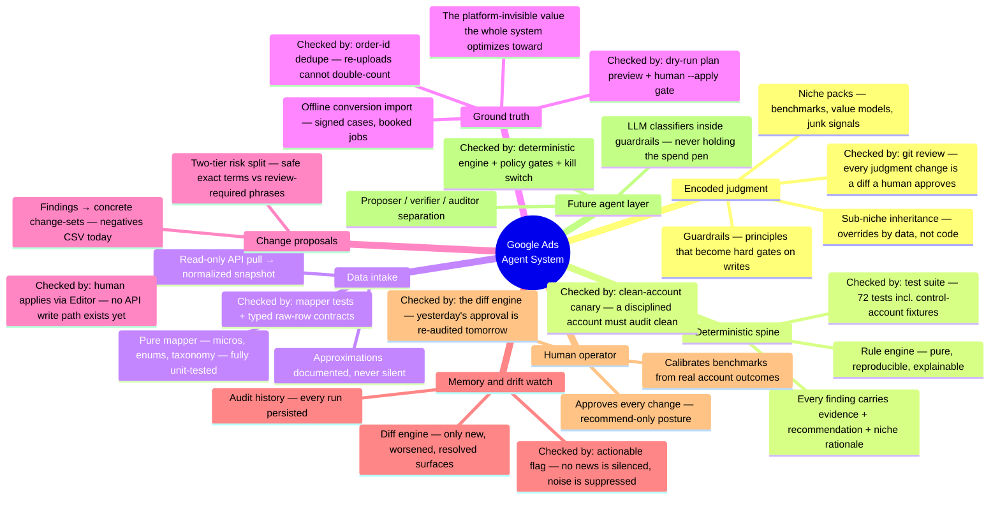
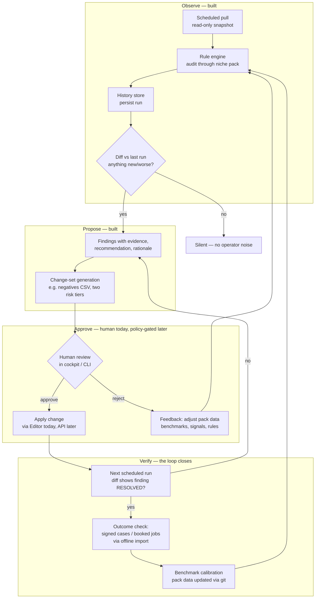

# Control architecture — checks, balances, and the optimization loop

Seed document for the control-workflow spec: who checks what, what checks
*them*, and how an account actually gets optimized. Everything labeled
**[built]** exists in this repo today; **[planned]** is the designed next rung.
GitHub renders the diagrams below natively.

## 1. The system as a mindmap

## 2. The account optimization loop

The loop has **two feedback frequencies**: the fast loop (daily diff — did the
account change?) and the slow loop (outcome data — did signed cases actually
get cheaper?). A change is not "verified" when the finding disappears; it's
verified when the slow loop confirms the economics moved. That distinction is
what keeps the system from gaming its own metrics — the exact failure mode of
platform-native automation.

## 3. Checks-and-balances matrix

| Actor / layer | What it checks | What checks IT |
|---|---|---|
| Niche packs (judgment) | Accounts, via benchmarks + rules | Git review of every data change; well-formedness tests; clean-account canary |
| Rule engine | Account state vs pack judgment | 72-test suite; determinism (same input → same report); error isolation (a crashing rule can't sink an audit) |
| Ingestion mapper | Raw API data → honest normalization | Unit tests per landmine (micros, enums, taxonomy); documented approximations |
| Conversion import | That bidding chases real value | Dry-run plan preview; human `--apply` gate; dedupe; partial-failure surfacing |
| Change-sets | That proposals are concrete + risk-tiered | Human applies them; Tier-2 overblock cautions; no auto-write path exists |
| Diff engine | Drift, regressions, whether fixes landed | Its own test suite; "actionable" logic reviewed like code |
| Human operator | Everything above — final approval | The diff engine re-audits the results of their approvals; outcome data scores their calls |
| Future LLM agents | Fuzzy classification, drafting | Deterministic engine bounds them; verifier/auditor agents; policy gates; kill switch |

## 4. How agents will validate other agents [planned]

When LLM agents enter (ambiguous search-term classification, ad-copy drafting,
intake-summary parsing), the control pattern is **separation of powers**:

1. **Proposer** — generates the candidate (e.g. "these 40 ambiguous terms are
   junk"). Never executes.
2. **Verifier** — independently re-derives the answer from the same evidence,
   prompted adversarially ("argue this term is actually a good lead").
   Disagreement → human queue, never auto-resolve.
3. **Auditor** — samples *agreed* decisions after the fact and scores them
   against outcome data (did blocking that term reduce waste without reducing
   signed cases?). Auditor findings flow back as pack-data edits — reviewed in
   git like everything else.
4. **Hard boundaries** — LLM output can only enter the system as *data through
   existing gates* (a proposed negative list enters the same two-tier review
   as rule-generated ones). No agent gets a write scope; the executor is
   deterministic code behind the approval queue, with per-change spend-impact
   caps, an audit log, and a kill switch.

The principle throughout: **judgment is versioned, execution is gated,
verification is independent, and ground truth is business outcomes — never
platform metrics.**

## 5. Autonomy ladder (where we are)

| Rung | Capability | Gate | Status |
|---|---|---|---|
| 0 | Manual audit on demand (cockpit, CLI) | — | **built** |
| 1 | Scheduled audits + diff alerts | read-only scope | **built** (cron endpoint + history) |
| 2 | Change-set generation for human application | human applies externally | **built** (negatives CSV) |
| 3 | Approval queue → API executor | human click per change-set | planned |
| 4 | Policy auto-execution of pre-approved change classes | policy definitions + spend caps + kill switch | planned |
| 5 | LLM agents proposing within guardrails | proposer/verifier/auditor + all rung-3/4 gates | planned |
