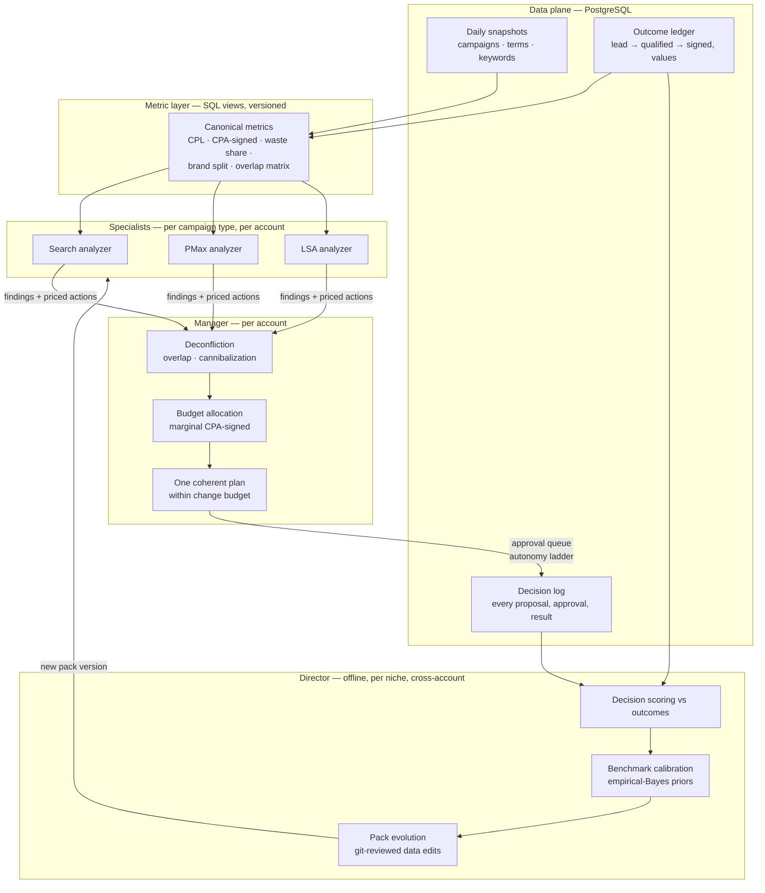

# Model architecture — critique and design for the multi-agent optimization system

This document dissects the proposed three-tier design (campaign-type
specialist models → "Manager" agent → "Director" orchestrator), keeps what
survives contact with reality, and replaces what doesn't. It builds directly
on `control-architecture.md` — nothing here bypasses the proposer/verifier/
auditor separation or the autonomy ladder.

---

## 1. The proposal, restated

1. **Specialists** — one model per campaign type (Search, Performance Max,
   LSA, Display, …), each with its own metrics, niche circumstances, and
   if-then pivot logic.
2. **Manager** — an agent that ingests all specialist outputs and molds them
   into one cohesive account strategy.
3. **Director** — a higher orchestrator that learns across everything to
   build better models for each niche.

## 2. Critique — what holds

- **Decomposition by campaign type is correct at the *analysis* layer.**
  Search, PMax, and LSA have genuinely different observable data (search
  terms vs. asset-group signals vs. lead records) and different levers
  (negatives/bids vs. asset exclusions/URL rules vs. job-type + geo + bid).
  A single generic analyzer would flatten those differences — the exact
  regression-to-the-mean failure this project exists to avoid.
- **Separating analysis from synthesis is correct.** Cross-campaign problems
  (budget allocation, cannibalization, channel mix) cannot be solved inside
  any one specialist. Something must own the account-level view.
- **A learning tier above the account is correct.** Benchmarks and junk-lead
  signals should get sharper as more accounts in a niche flow through the
  system. That is precisely what the niche-pack layer is for.

The shape mirrors how a good agency actually staffs an account: channel
specialists → account manager → practice-lead who pattern-matches across
clients. The instinct is sound. Four failure modes need to be designed out.

## 3. Critique — what breaks

### 3.1 "Model" conflates three different things

The proposal uses *model* for what are actually three components with
different failure characteristics and different safety requirements:

| Component | What it is | Fails by | Made safe by |
|---|---|---|---|
| **Estimator** | Statistics/ML that scores things (P(term is junk), expected CPA-signed) | Being *wrong* | Confidence intervals, priors, backtesting |
| **Policy** | If-then pivot logic that maps estimates → proposed actions | Being *trigger-happy* | Data gates, hysteresis, cooldowns, change budgets |
| **Agent** | LLM doing fuzzy work (intent classification, drafting, synthesis) | Being *confidently hallucinatory* | Verifier separation, output-as-data-only, no write scope |

"Bullet-proof" is not a property a model can have. It is a property of the
**system**: estimators are allowed to be uncertain, policies are forbidden
from acting on uncertainty, and agents are never load-bearing for
correctness. Collapse these into one "model" and you get a thing that is
simultaneously unauditable and trigger-happy.

### 3.2 Data sparsity kills per-campaign-type ML at this scale

The underwriting-style approach — hundreds of weighted features feeding a
trained classifier — works when you have thousands of labeled outcomes. A
funding book has that. A Google Ads account in a high-value niche does not:

- A personal-injury account spending $30k/mo sees maybe **50–150 leads and
  5–15 signed cases per month**.
- Split that across campaign types and you're fitting a per-type model on
  **single-digit monthly outcomes**.
- A model with 200 features and 10 labels doesn't learn; it memorizes noise
  and hands you confident garbage with a feature-importance chart.

Consequences for the design:

1. **Deterministic rules + niche benchmarks are the v1 "model"** — which is
   what the engine already is. This isn't a placeholder for the real ML; for
   per-account decisions it will likely *remain* the primary layer.
2. **Statistical learning enters as estimation under priors, not as a
   trained classifier** (see §6): niche-pack benchmarks are the prior,
   account data updates it, and decisions key off credible intervals.
3. **Real ML only becomes viable cross-account, per niche** — pooling every
   PI-law account's search terms gives the Director a real training set for
   e.g. a junk-term classifier. That is a Director-tier asset, not a
   per-account one.

### 3.3 Specialists without a shared ground-truth ledger re-create the platform's failure

If each campaign-type specialist optimizes its own silo (Search optimizes
CPL, PMax optimizes ROAS-on-platform-conversions, LSA optimizes booked
calls), the system regresses to exactly the pathology it was built against —
because platform metrics *per channel* are the most gameable numbers in the
building. PMax will happily "win" by absorbing brand queries Search would
have converted for a tenth of the price.

Two hard requirements:

- **One value model per account, owned above the specialists.** Every
  specialist prices its findings in the same unit: **expected
  cost-per-signed-outcome**, using the pack's `ConversionValueModel`. No
  specialist ever cites platform ROAS as evidence of health.
- **The Manager's primary job is deconfliction, not summarization.** The
  most valuable cross-campaign signals are overlap and cannibalization:
  brand terms leaking into PMax, the same query converting in two
  campaigns, LSA and Search bidding on the same emergency intent. These are
  computable — mostly joins over search-term data — and belong to the
  Manager because no specialist can see them.

An LLM "molding together a cohesive strategy" from specialist prose is the
weak version of this tier. The strong version is: deterministic conflict
detection + a constrained budget-allocation step + an LLM that *narrates
and stress-tests* the plan, with the verifier pattern from
`control-architecture.md` §4.

### 3.4 The Director must be offline, or the hierarchy compounds errors

A live orchestrator that ingests Manager outputs to steer accounts in real
time adds a third inference layer where each layer's noise multiplies —
an expensive telephone game with the spend pen at the end of it. The
Director's real jobs are all **slow-loop** jobs:

- **Score past decisions against outcomes** (did blocking that term reduce
  waste without reducing signed cases 60 days later?).
- **Calibrate benchmarks** from pooled per-niche data (empirical Bayes
  priors, updated quarterly, shipped as pack-data edits).
- **Evolve the packs** — propose new rules, junk signals, thresholds — as
  git diffs a human reviews, exactly like every other judgment change.
- **Train the pooled models** (§3.2.3) once volume justifies them.

The Director never touches an account. It ships better *packs*, and the
fast loop runs on whatever pack version is deployed. That keeps the
hierarchy's error budget flat instead of multiplicative — and it means the
Director's output is versioned, diffable, and revertible.

## 4. The corrected architecture



Key properties:

- **Specialists and Manager run in the fast loop** (daily), are mostly
  deterministic, and emit findings *priced in expected signed-outcome
  economics* with evidence.
- **The Director runs in the slow loop** (weekly/quarterly), cross-account,
  and its only output is versioned pack changes.
- **LLM agents slot in at three points only**: fuzzy classification inside
  specialists (ambiguous search terms), drafting (ad copy, negatives
  rationale), and plan narration/stress-testing at the Manager. All three
  follow proposer/verifier/auditor; none holds a write scope.

## 5. The metric layer — small, canonical, versioned

Not hundreds of weighted features — that's the sparse-data trap (§3.2). A
few dozen **interpretable** metrics, defined once in SQL views so every
tier reads identical numbers. Illustrative core set:

**Account-level (Manager's dashboard)**
| Metric | Definition | Why it exists |
|---|---|---|
| `cpa_signed` | spend ÷ signed outcomes (offline ledger) | The north star; everything prices in this unit |
| `cpl`, `lead_to_signed_rate` | standard funnel math vs. pack benchmarks | Detects "cheap leads, no cases" drift |
| `verified_value_share` | % of bidding conversions that are verified outcomes | Conversion-integrity guard |
| `waste_share` | spend on terms matching junk signals ÷ total spend | The headline waste number |
| `brand_spend_share` | brand-term spend ÷ total | Cannibalization input |
| `overlap_index` | pairwise: % of converting queries shared between campaigns | Deconfliction input |
| `change_budget_used` | changes applied this window ÷ allowed | Thrash guard |

**Search specialist**
`term_expected_value` (per §6), `negative_coverage`, match-type mix drift,
quality-score-weighted CPC vs. benchmark, impression-share lost (budget vs.
rank), after-hours spend share (vs. intake coverage).

**PMax specialist**
brand-query leakage rate, asset-group spend concentration, search-terms
insight junk share, % spend in channels with zero ledger-verified outcomes.

**LSA specialist**
booked-rate by job type, dispute/credit rate, response-time distribution,
geo overlap with Search spend.

Each metric definition lives in a versioned SQL view; changing a definition
is a reviewed diff, because the metric layer *is* part of the judgment.

## 6. Decision math for sparse data — priors, not point estimates

The bullet-proofing mechanism for per-account decisions. Raw rates lie at
low volume: a term with 0 conversions on 12 clicks is not "0% converting",
and one with 1 conversion on 3 clicks is not a star. The fix is standard
**empirical-Bayes shrinkage**:

1. The niche pack supplies the prior — e.g. lead rate for non-brand PI
   search terms ~ `Beta(α, β)` fitted by the Director from pooled niche
   data (v1: hand-set from the existing benchmark ranges).
2. Each term/keyword/asset-group updates the prior with its own clicks and
   outcomes → a posterior distribution, not a point estimate.
3. **Policies act on credible intervals, never on means.** A pivot fires
   only when the posterior is decisively on the wrong side of the
   threshold.

Example pivot rule, fully specified:

> **Pause a non-brand term** when
> `P(cost_per_signed > 3 × pack.cpa_signed.max) ≥ 0.90`
> **and** spend ≥ max($150, 3 × pack.cpc.typical × 20)   *(data gate)*
> **and** the term has ≥ 45 days of ledger maturity   *(outcome lag)*
> **and** no pause/unpause of this term in the last 21 days   *(cooldown)*
> **and** account `change_budget_used < 100%`.   *(thrash guard)*
> Re-enable review only if the pack prior later shifts by ≥ 1 benchmark
> step *(hysteresis — the undo threshold is not the do threshold)*.

Every if-then pivot in every specialist takes this shape: **estimate with
uncertainty → gate on sufficiency → act with hysteresis → log for scoring**.
The thresholds themselves are pack data — which is what makes them
Director-tunable and git-reviewable rather than hard-coded.

Outcome lag is a first-class constraint: signed cases land 30–90 days after
the click. The scoring and maturity windows must respect it, or the system
will punish campaigns for revenue that simply hasn't arrived yet.

## 7. PostgreSQL schema (the `HistoryStore` successor)

The `HistoryStore` port was designed for exactly this swap. Core tables:

```sql
-- Identity & configuration
accounts(id, external_id, name, niche_pack_id, pack_version, currency, ...)

-- Fast-loop facts (append-only, daily grain)
campaign_daily(account_id, campaign_id, date, type, cost, clicks,
               impressions, conversions, conversion_value, budget, ...)
search_term_daily(account_id, campaign_id, date, term, matched_keyword,
                  match_type, clicks, cost, conversions)
keyword_daily(...), asset_group_daily(...)

-- Ground truth (the moat)
leads(id, account_id, gclid, campaign_id, lead_at, source, raw_ref)
outcomes(id, lead_id, stage,           -- qualified | signed | booked | lost
         stage_at, value, verified)

-- Decisions (what makes the system improvable)
findings(id, account_id, run_id, rule_id, severity, confidence,
         evidence jsonb, estimated_monthly_waste, created_at)
proposals(id, finding_id, action_type, target_ref, params jsonb,
          expected_impact jsonb, status,   -- proposed|approved|rejected|applied
          decided_by, decided_at, applied_at)
decision_scores(proposal_id, horizon_days, waste_delta, signed_delta,
                verdict, scored_at)        -- Director writes these

-- Learning artifacts
pack_versions(id, pack_id, version, source,  -- 'human' | 'director-proposed'
              diff_ref, approved_by, deployed_at)
priors(niche_pack_id, metric, entity_class, alpha, beta, fitted_at, n_accounts)
```

Design notes:

- **Append-only facts + immutable decision log.** The decision log is the
  single most valuable table in the system — it's what lets the Director
  score judgment instead of guessing. Every proposal stores its
  *expected* impact so scoring can compare expectation vs. reality.
- The metric layer (§5) is views over these tables; specialists read views,
  never raw tables.
- `priors` is deliberately tiny — the Director's learned output compresses
  to a handful of distribution parameters per niche per metric. That's a
  feature: it's inspectable and diffable, unlike model weights.

## 8. The continuous-improvement loop, end to end

```mermaid
sequenceDiagram
    participant P as Pack vN
    participant S as Specialists + Manager
    participant H as Human (approval queue)
    participant G as Google Ads
    participant L as Outcome ledger
    participant D as Director (offline)

    S->>S: Daily: metrics → findings → priced proposals
    S->>H: One coherent plan (within change budget)
    H->>G: Approve → apply (ladder rung 3/4)
    Note over S,H: expected impact logged with every proposal
    G-->>L: clicks → leads; CRM → signed outcomes (30–90d lag)
    L-->>D: Weekly: score matured decisions vs expectations
    D->>D: Recalibrate priors, evolve rules/thresholds
    D->>H: Pack vN+1 as a git diff
    H->>P: Review, merge, deploy
    P->>S: Fast loop now runs sharper judgment
```

Improvement is **versioned pack releases**, not silent online drift. If
pack vN+1 performs worse, revert the commit. Once volume allows, promote
calibration to per-cohort A/B: deploy vN+1 to half the accounts in a niche
and let `decision_scores` pick the winner.

## 9. Build order

| Phase | Deliverable | Unblocks |
|---|---|---|
| 1 | Postgres store behind `HistoryStore` port; daily fact ingestion; outcome ledger (extend the existing offline-import path to also write locally) | Everything below |
| 2 | Metric layer as SQL views + `overlap_index` deconfliction queries | Manager tier |
| 3 | Specialist split of the rule engine (Search first — it's where the data is richest); proposals table + expected-impact logging | Decision scoring |
| 4 | Empirical-Bayes term/keyword scoring with pack priors; policy gates (data gate, cooldown, hysteresis, change budget) | Safe pivot logic |
| 5 | Manager: deconfliction + budget reallocation + single-plan output; approval queue (ladder rung 3) | Coherent strategy |
| 6 | Director v1: decision scoring + benchmark calibration as proposed pack diffs | Continuous improvement |
| 7 | LLM agents inside guardrails (ambiguous-term classifier with verifier; plan narrator) — ladder rung 5 | Scale of judgment |

Each phase is independently shippable and each produces data the next phase
needs. Phase 1 is the keystone: **no ledger, no learning** — every
downstream tier is only as good as the outcome data under it.

## 10. Summary of the dissection

| Your proposal | Verdict | Correction |
|---|---|---|
| Campaign-type-specific models | ✅ Keep | As *analyzers* (rules + estimators + scoped LLM tasks), not trained ML models; all priced in one value unit |
| Hundreds of weighted metrics | ❌ Replace | A few dozen canonical, interpretable metrics in versioned SQL; learning compresses into priors, not weights |
| Manager molding cohesive strategy | ✅ Keep, sharpen | Primary job is deterministic deconfliction + budget math; LLM narrates and stress-tests, doesn't decide |
| Director building better models | ✅ Keep, move offline | Cross-account, per-niche, slow-loop; only output is git-reviewed pack versions; never touches accounts live |
| Bullet-proof model | 🔁 Reframe | Bullet-proofing lives in the system: uncertainty-aware estimates, gated policies, hysteresis, change budgets, immutable decision log, versioned judgment |
| Continuous improvement | ✅ Keep | Expectation-vs-outcome scoring of every decision; improvement ships as pack releases, revertible like code |
